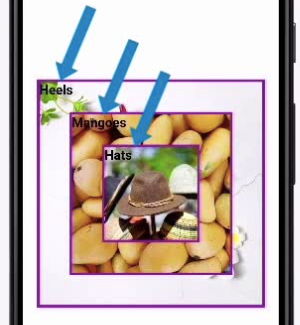

# app10 : Implementing Stacks, Lists and Grids in Flutter

## Getting Started
The stack, list, and grid layouts are very popular in mobile applications because they make great use of screen real estate and allow us to represent information in a manner that is easy for users to understand and parse. In app, we will learn to use the Stack widget to layer widgets one on top of another. we will use relative and positioned widgets as a part of the stack and see that positioned widgets give us very fine-grained control over where a widget is placed. 

Next, we will represent elements using the ListView. we will configure the properties of the ListView to match our use case and use the ListTile and the Card widgets to build list elements. We will also build list views with an infinite number of elements. Finally, we will represent our app elements using the GridView.

Moving on from the row and column widgets, in this demo, we'll explore yet another widget that is very useful to layout our Flutter apps the way we want them to be. We'll explore the stack widget. The stack is a built-in widget in Flutter which allows us to make

a layer of widgets by putting them one on top of the other. we may have noticed in mobile applications, we often have an image and layered on top of that image is some text or maybe a button. All of that is accomplished using the stack. Let's take a look at how we can set up very simple stack in our app.

Child of the container is the Stack widget.

This Stack widget contains three containers layered one on top of the other. 

Let's run this application and see what this stack looks like. And here we have three containers, one container layered on top of another. The 1st Container is the black one that is 300 pixels by 300 pixels. Layered on top of that we have the 2nd Container that is blue and then layered on top of that is the 3rd Container that is purple. Since every layer in this stack has a smaller size than previous layers, we can see the layers very clearly. But this is how you stack up layers using the Stack widget.

## Creating Non-positioned and Positioned Widgets

Every child of a stack widget can be one of two types. They can be positioned widgets or non-positioned widgets. All the children we've seen so far have been non-positioned widgets. Positioned children are those which are wrapped in a positioned widget. The way the stack works is that the stack sizes itself to contain all the non-positioned children which are positioned according to what alignment we have specified. The positioned children are then placed relative to the stack according to their top, right, bottom, and left properties. Now, this will become clearer when we take a look at this example. Now, I'm going to go straight to the body of the Scaffold, which contains a Container with alignment set to center.

In this first iteration of the code, we'll layer three images so one is on top of the other. The images have different sizes, so you can see all three. Take a look at what the output is going to be after we complete this demo. This is on the right side of your screen. Another thing to observe is that every image has some text layered over the image. We'll use a nested stack for that as well. So, you can see the text for Heels, Mangoes, and Hats. They're layered over their associated image. Our first Stack is going to comprise of three containers which wrap image assets. These are the children of the individual containers.

Now, each container is going to be a non-positioned object. So, all of the children of this Stack are not positioned. I have the Stack alignment set to Alignment.center means that the children of the stack will be positioned at the center of the stack, aligned at the center. The children property is set the first Container defined a height and width, both of which are 350 by 350. It has the purple color and its child is aligned on the bottomLeft. The child is a Padding element which has another child that is a stack, and we have a nested Stack within the first container of the outer stack. This essentially layers the text on top of the image.

We have three images. Each image has some text layered over it in the top left corner. That is where the Stack places layers by default and each image with text is now layered one on top of the other. Now, so far, our stack has only used non-positioned objects. How do we use positioned objects within a stack? 

I'm going to replace the code that I have here on screen and observe the body property. The body is set to a Container. This is on line 18 and the child of this container is the Stack.

[Video description begins] Line 18 reads as: body: Container(. [Video description ends]

Now, this Stack is interesting. It has three children, one of which is a non positioned object. That's the SizedBox on lines 22 through 26 and then we have two Positioned objects on lines 27 and 34.

[Video description begins] Line 22 reads as: SizedBox(. Line 23 reads as: height: 300,. Line 24 reads as: width: 300,. Line 25 reads as: child: Image.asset('images/heels.jpg'). Line 26 reads as: ), // SizedBox(. [Video description ends]

The Positioned widget works exactly like its name sounds.

[Video description begins] Line 27 reads as: Positioned(. Line 28 reads as: bottom: 0,. Line 29 reads as: right: 0,. Line 30 reads as: child: Image.asset(. Line 31 reads as:'images/mangoes.jpg',. Line 32 reads as: height: 200,. Line 33 reads as: width: 200,)) , // Image.asset, Positioned. [Video description ends]

The Positioned widget allows you to arbitrarily position widgets at specific positions within a stack. It's usually used to position child widgets in stack or some other similar widget. Now, what this Stack defined on line 20 will do is place the first non-positioned child,

that is the SizedBox defined on lines 22 through 26. So, that has a height and width of 300 by 300 and it has a child that is an image. The stack will now size itself to the size of its non-positioned child, that is the SizedBox. I'll now show you an inset picture of what the final result looks like. Observe the image at the very back, the image of heels. That's the image in our SizedBox. The size of the stack is set to that image. Now, I have a Positioned object defined on lines 27 through 33. On line 30, you can see that this positioned object contains the mangoes image as a child. Observe the properties are set on the positioned object, bottom 0, right 0. This is the precise position that we want for mangoes.

The bottom of this widget should be 0 pixels from the bottom of the stack that is our outer container, and the right of this widget should be 0 pixels from the right edge of the stack. And this gives us the result that we see in the inset image, the mangoes image is layered over the bottom heels image, and it's flush against the bottom and the right of that image. Next, let's look at the second Positioned image, the one for hats defined on lines 34 through 39.

[Video description begins] Line 34 reads as: Positioned(. Line 35 reads as: top: 0,. Line 36 reads as: left: 0,. Line 37 reads as: child: Image.asset(. Line 38 reads as:'images/hats.jpeg',. Line 39 reads as: height: 200,. [Video description ends]

The top is at 0 pixels and the left is at 0 pixels. So, the top should be 0 pixels from the top edge of the container, and the left edge of this widget should be 0 pixels from the left edge of the container. And that's exactly why the hat image layered on top of the heels image and the mangoes image is flush against the top left of the stack. The size of the stack is equal to the size of the heels image.

I'm just going to quickly run this and make sure we get the output that we expect. Yes, we have the heels image at the very bottom that is the size of our stack. Then we have the mangoes layered over it in a positioned manner and the hat layered over the mangoes image, again in a positioned manner. Before we wind up our discussion on the stack, let's look at one last example here, where I'm going to have three positioned widgets within my stack. The Stack is defined on line 18, and it has multiple children.

[Video description begins] Line 18 reads as: child:Stack(. Line 19 reads as: children:[. Line 20 reads as: const SizedBox(. Line 21 reads as: height: double.infinity,. Line 22 reads as: width: double.infinity,. Line 23 reads as: ) , //SizedBox. [Video description ends]

I'm now going to scroll down so we can focus on the stack. The first child of the stack is a SizedBox defined on lines 20 through 23, and I've set the height and width of the box to be equal to infinity. That is, this SizedBox fills up all of the available space in our screen. Since this is a non-positioned child of the stack, the size of the stack will be equal to the size of this child.

I then have a Container that holds an image. It's nicely decorated with a BoxDecoration with Shadow, blur, spread, and offset. This is to give a 3-dimensional feel to the image that is held within that container. The inset picture will give you an idea of what the final layout looks like.

[Video description begins] Line 27 reads as: child: Container(. Line 28 reads as: decoration: const BoxDecoration(. Line 29 reads as: boxShadow: [. Line 30 reads as: BoxShadow(. Line 31 reads as: color: Colors.grey,. Line 32 reads as: blurRadius: 10.0,. Line 33 reads as: spreadRadius: 3.0,. Line 34 reads as: offset: Offset(10.0, 10.0),. Line 35 reads as: ) , //BoxShadow. Line 36 reads as: ],. Line 37 reads as: ) , //BoxDecoration. Line 38 reads as: height: 300,. Line 39 reads as: width: 300,. Line 40 reads as: child: Image.asset('images/heels.jpg'). Line 41 reads as: ) , // Container. [Video description ends]

On lines 25 and 26, I have specified where this container should be positioned. It's within a Positioned widget. The top of this Positioned widget should be 100 pixels from the top

[Video description begins] Line 25 reads as: top: 100,. Line 26 reads as: left: 50,. [Video description ends]

edge of the stack and the left edge of this positioned widget should be 50 pixels from the left edge of the stack. I'm now going to scroll down to the second Positioned widget defined on line 43, this is what displays the heels image in our inset picture.

[Video description begins] Line 43 reads as: Positioned(. Line 44 reads as: top: 70,. Line 45 reads as: right: 30,. Line 46 reads as: child: Container(. Line 47 reads as: decoration: const BoxDecoration(. Line 48 reads as: boxShadow: [. Line 49 reads as: BoxShadow(. Line 50 reads as: color: Colors.grey,. Line 51 reads as: blurRadius: 10.0, Line 52 reads as: spreadRadius: 3.0,. Line 53 reads as: offset: Offset(10.0, 10.0),. Line 54 reads as: ) , //BoxShadow. Line 55 reads as: ],. Line 56 reads as: ) , //BoxDecoration. Line 57 reads as: height: 200,. Line 58 reads as: width: 200,. Line 59 reads as: child: Image.asset(. Line 60 reads as: 'images/mangoes.jpg'. Line 61 reads as: ) , // Image.asset. Line 62 reads as: )) , //Container, Positioned. [Video description ends]

You can see that the top edge should be 70 pixels from the top of the stack, that is the top of the screen and the right edge, we have said should be 30 pixels from the right edge of the stack. And then finally, we have the last Positioned widget, an image of books. The bottom edge is 200 pixels from the bottom of the stack that is the bottom of the screen in our case, and its left edge is 70 pixels from the left of the stack. I'm going to run this and you'll see that we'll get the output that we had in the inset picture, and you can see how the images have a nice shadow effect and they are layered one on top of the other. Now, the position of these images depend on the edges of the stack which depend on the SizedBox. Now, if I'm going to change the height and width of the SizedBox, I've set the height to 400 and let's say, I set the width to another value also 400.

Now, I have changed the dimensions of the non-positioned child and this actually changes the dimensions of the stack. This means that the positions that we've set relative to the top, right, left, and bottom edges of the stack will move our existing widgets around, and that's what you see when you reload this app. An important detail you need to remember is that positioned widgets in a stack are positioned relative to the edges of the stack.